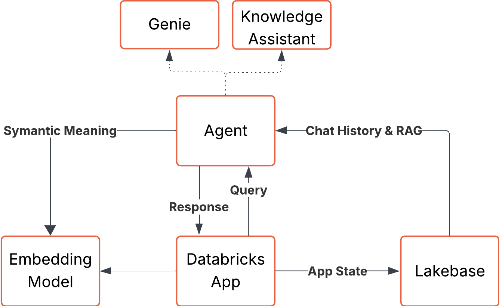

# Databricks for AdTech Solutions Repository

Welcome to the Databricks for AdTech Solutions repository — a comprehensive collection of AdTech solutions, including a sophisticated AI-powered chat application with multi-agent capabilities, data analysis tools, and policy governance frameworks.

### Architecture Diagrams


For detailed architecture information, see the individual component READMEs:
- [Clade Code Memory File](./adtech_series/app_lakebase/CLAUDE.md)
- [Policy Framework](./knowledge_assistant_policies/README.md)
- [Genie Instructions](GENIE.md)

## Repository Structure

This repository contains four main components that work together to create a complete AdTech AI solution:

### AI Chat Application (`adtech_series/app_lakebase/`)
An AI chatbot built with Dash that features:
- Multi-agent architecture with specialized agents for data analysis and policy compliance
- Persistent chat history with PostgreSQL + pgvector for semantic search
- Integration with Databricks Genie and Knowledge Assistant agents
- Real-time streaming responses and conversation management

### Data & Analytics (`megacorp_data/` + Dashboard)
- Sample datasets for marketing campaigns, audience profiles, and segment definitions
- Pre-built AIBI Genie dashboard for campaign analysis
- Metric views and KPI definitions for business intelligence

### Policy Governance (`knowledge_assistant_policies/`)
- Comprehensive policy pack with 20 AdTech compliance documents
- Knowledge Assistant integration for real-time policy validation
- Coverage of privacy, brand guidelines, legal compliance, and data governance

### AI Agents (`adtech_series/app_lakebase/agents/`)
- Custom multi-agent system with Genie, General Assistant, and Marketing Policy agents
- Knowledge Assistant powered by Databricks Agent Bricks
- Advanced conversation handling with context-aware responses

## What You'll Find in This Repository

### Marketing Data & Analytics

#### Data Sources (`megacorp_data/`)
- **`megacorp_campaigns.parquet`** - Marketing campaign data linking individuals to campaigns
- **`megacorp_audience_census_profile.parquet`** - Demographic and behavioral profiles (age, gender, location, pet ownership)
- **`megacorp_segment_definitions.parquet`** - Marketing segment definitions and descriptions
- **`megacorp_audience_census_profile_metric_view.json`** - Business KPI metric definitions

#### AIBI Dashboard
- **`MegaCorp Campaigns AIBI Demo.lvdash.json`** - Pre-built Lakeview dashboard for campaign analysis
- Interactive widgets for segment analysis, demographic breakdowns, and match funnels
- Integration with Genie Space for natural language querying

### AI Chat Application Features

#### Multi-Agent Architecture
- **Genie Agent**: Specialized for data analysis and database queries
- **General Assistant**: Synthesizes information and provides comprehensive answers
- **Marketing Policy Agent**: Knowledge Assistant for policy compliance validation

#### Advanced Capabilities
- Persistent conversation history with semantic search
- Context-aware responses using pgvector embeddings
- Real-time streaming responses
- Policy compliance checking and brand guideline enforcement

### Policy & Compliance Framework

The [`knowledge_assistant_policies`](./knowledge_assistant_policies) directory contains 20 comprehensive policy documents covering:
- Data governance and privacy protection
- Brand voice and creative guidelines
- Regional compliance and legal requirements
- Campaign approval workflows and accessibility standards

## Complete Deployment Guide

### Prerequisites

Before deploying this solution, ensure you have:

#### Databricks Workspace Requirements
- Databricks workspace in **us-east-1** or **us-west-2** (required for Agent Bricks)
- **Mosaic AI Agent Bricks Preview** enabled
- **Unity Catalog** configured
- **Serverless compute** available
- Access to **foundation models** (for LLM endpoints)

#### Required Tools
- [Databricks CLI](https://docs.databricks.com/en/dev-tools/cli/install.html) configured with workspace authentication
- [Terraform](https://www.terraform.io/downloads.html) (>= 1.0)
- [Just](https://github.com/casey/just) command runner
- [UV](https://docs.astral.sh/uv/) Python package manager
- [jq](https://stedolan.github.io/jq/) for JSON processing

### End-to-End Deployment Process

The deployment follows a specific order due to component dependencies:

```
Phase 1: Data Foundation     → Phase 2: Knowledge Assistant
        ↓                            ↓
Phase 3: Dashboard & Genie   → Phase 4: Chat Application
```

#### Phase 1: Data Foundation
1. Import datasets into Databricks
2. Upload parquet files from megacorp_data/ to Unity Catalog
3. Configure tables: megacorp_campaigns, megacorp_audience_census_profile, megacorp_segment_definitions

#### Phase 2: Knowledge Assistant Creation
1. Create Knowledge Assistant using Agent Bricks
2. Upload policy documents from knowledge_assistant_policies/ into a Unity Catalog Volume
3. Create & Deploy a knowledge assistant AI Brick in Agent Bricks
4. Update `adtech_series/app_lakebase/resources/agent.job.yml with your agent endpoint.

#### Phase 3: Dashboard & Genie Space
1. Import MegaCorp Campaigns AIBI Demo.lvdash.json
2. Update Dashboard to point your imported tables
3. Generate an [embedded dashboard](https://docs.databricks.com/aws/en/dashboards/embedding/) and copy the URI to the environment variable `DASHBOARD_IFRAME` in [app.yml](adtech_series/app_lakebase/app/app.yml)
4. Create Genie Space connected to your data, look at [GENIE.md](GENIE.md) for instructions.
5. Update `genie_space_id` in the [agent deployment job](adtech_series/app_lakebase/resources/agent.job.yml).

#### Phase 4: Chat Application & Multi-Agent Deployment
```bash
cd adtech_series/app_lakebase/

# Complete end to end deployment of the agent and application
just full-deploy-agent

# Compelte end to end deployment of the application
just full-deploy

# Or step-by-step:
just terraform-full      # Deploy infrastructure
just set-secret          # Setup secret for Agent Endpoint
just bundle-deploy       # Deploy our asset bundle
just migrations-upgreade # Run SQL migrations
just agent-deploy        # Deploy AI agents
just app-start           # Start compute
just app-deploy          # Deploy to compute
```

### Validation Steps

After deployment, verify each component:

1. **Data Layer**: Query tables in Unity Catalog
2. **Knowledge Assistant**: Test policy questions via Agent Bricks UI
3. **Dashboard**: Open Lakeview dashboard and verify data visualization
4. **Genie Space**: Test natural language queries
5. **Chat Application**: Access deployed app and test multi-agent conversations

### Configuration Files

Key configuration files to customize:

- `adtech_series/app_lakebase/databricks.yml` - Workspace and bundle configuration
- `adtech_series/app_lakebase/app/app.yml` - Application environment variables
- `adtech_series/app_lakebase/terraform/terraform.tfvars` - Infrastructure variables

### Common Deployment Issues

- **Agent Bricks Access**: Ensure workspace has preview feature enabled
- **Region Requirements**: Must be in us-east-1 or us-west-2
- **Endpoint Dependencies**: Knowledge Assistant must be deployed before chat app
- **Data Connections**: Verify table permissions and catalog access
- **Authentication**: Ensure proper service principal configuration

## Additional Resources

### Documentation Links
- [Databricks Agent Bricks Documentation](https://docs.databricks.com/aws/en/generative-ai/agent-bricks/)
- [Unity Catalog Setup Guide](https://docs.databricks.com/en/data-governance/unity-catalog/index.html)
- [Lakeview Dashboard Documentation](https://docs.databricks.com/en/dashboards/index.html)
- [Genie Spaces Documentation](https://docs.databricks.com/en/genie/index.html)

## Development & Contribution

### Local Development
```bash
cd adtech_series/app_lakebase/
just venv          # Set up development environment
just run           # Run application locally
```

## Support Disclaimer

The content provided here is for reference and educational purposes only.
It is not officially supported by Databricks under any Service Level Agreements (SLAs).
All materials are provided AS IS, without any guarantees or warranties, and are not intended for production use without proper review and testing.

The source code in this project is provided under the Databricks License.
All third-party libraries included or referenced are subject to their respective licenses.

If you encounter issues while using this content, please open a GitHub Issue in this repository.
Issues will be reviewed as time permits, but there are no formal SLAs for support.

## License

&copy; 2025 Databricks, Inc. All rights reserved. The source in this notebook is provided subject to the Databricks License [https://databricks.com/db-license-source].  All included or referenced third party libraries are subject to the licenses set forth below.
