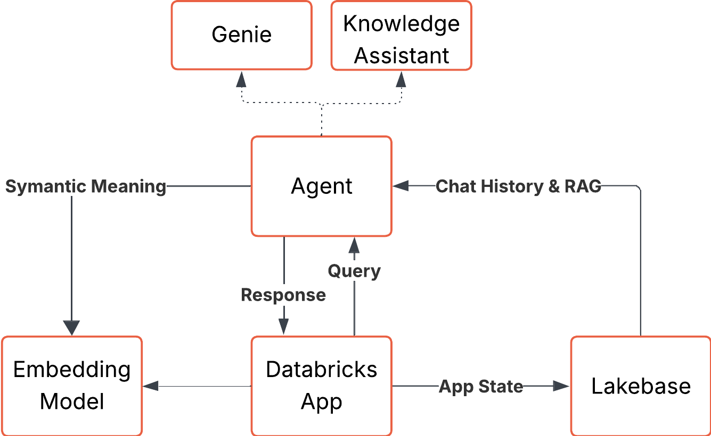

# AI Chat Application — Databricks Apps & Lakebase

A multi-agent AI chatbot built with **Dash** that integrates Databricks Genie and Knowledge Assistant agents, with persistent chat history backed by **Databricks Lakebase** (PostgreSQL + pgvector for semantic search).

This is the flagship deliverable for the FY25 **Apps & Lakebase** session (Sept 23, 2025), led by Charlie Hohenstein, Tanner Wendland, and David Qiu.

## Architecture



- **Frontend** — Dash app (`app/dash_app.py`)
- **Backend** — Databricks Lakebase (Postgres + pgvector) for conversation persistence and semantic search
- **Agents** — multi-agent system served via a Databricks serving endpoint
  - **Genie Agent** — natural-language SQL over your data
  - **General Assistant** — synthesizer / fallback
  - **Marketing Policy Agent** — Knowledge Assistant for compliance validation
- **Infrastructure** — Terraform-managed Lakebase resources

See [`CLAUDE.md`](./CLAUDE.md) for the AI agent memory file (conventions for AI-assisted edits to this codebase).

Also in this folder: [`ad_tech_genie_demo/`](./ad_tech_genie_demo/) — Charlie's standalone Streamlit Genie demo (separate app, same session).

## Prerequisites

### Databricks workspace
- Workspace in **us-east-1** or **us-west-2** (required for Agent Bricks)
- **Mosaic AI Agent Bricks Preview** enabled
- **Unity Catalog** configured
- **Serverless compute** available
- Access to **foundation models** for LLM endpoints

### Local tooling
- [Databricks CLI](https://docs.databricks.com/en/dev-tools/cli/install.html) authenticated to your workspace
- [Terraform](https://www.terraform.io/downloads.html) ≥ 1.0
- [Just](https://github.com/casey/just) command runner
- [UV](https://docs.astral.sh/uv/) Python package manager
- [jq](https://stedolan.github.io/jq/) for JSON processing

## End-to-end deployment

Deployment has component dependencies, so phases must run in order:

```
Phase 1: Data Foundation     → Phase 2: Knowledge Assistant
        ↓                            ↓
Phase 3: Dashboard & Genie   → Phase 4: Chat Application
```

### Phase 1 — Data foundation
1. Import datasets into Databricks
2. Upload parquet files from [`../shared/megacorp_data/`](../shared/megacorp_data/) to a Unity Catalog volume
3. Configure tables: `megacorp_campaigns`, `megacorp_audience_census_profile`, `megacorp_segment_definitions`

### Phase 2 — Knowledge Assistant
1. Create a Knowledge Assistant using Agent Bricks
2. Upload the policy documents from [`../agents/knowledge_assistant_policies/`](../agents/knowledge_assistant_policies/) into a Unity Catalog volume
3. Create & deploy the Knowledge Assistant in Agent Bricks
4. Update [`resources/agent.job.yml`](./resources/agent.job.yml) with your agent endpoint

### Phase 3 — Dashboard & Genie
1. Import [`../aibi_genie/MegaCorp Campaigns AIBI Demo.lvdash.json`](../aibi_genie/)
2. Update the dashboard to point at your imported tables
3. Generate an [embedded dashboard](https://docs.databricks.com/aws/en/dashboards/embedding/) and copy the URI to `DASHBOARD_IFRAME` in [`app/app.yml`](./app/app.yml)
4. Create a Genie space connected to your data — see [`../aibi_genie/GENIE.md`](../aibi_genie/GENIE.md) for the configuration
5. Update `genie_space_id` in [`resources/agent.job.yml`](./resources/agent.job.yml)

### Phase 4 — Chat application

```bash
cd adtech_series_fa25/app_lakebase/

# End-to-end deploys
just full-deploy-agent      # Agent + app
just full-deploy            # App only

# Or step-by-step
just terraform-full         # Deploy infrastructure
just set-secret             # Set up agent endpoint secret
just bundle-deploy          # Deploy the asset bundle
just migrations-upgrade     # Run SQL migrations
just agent-deploy           # Deploy the AI agents
just app-start              # Start compute
just app-deploy             # Deploy to compute
```

## Validation

After deployment, verify each component:

1. **Data layer** — query tables in Unity Catalog
2. **Knowledge Assistant** — test policy questions via the Agent Bricks UI
3. **Dashboard** — open the Lakeview dashboard and confirm visualizations render
4. **Genie space** — test natural-language queries
5. **Chat app** — open the deployed app and run a multi-agent conversation

## Configuration files

- [`databricks.yml`](./databricks.yml) — workspace + bundle config
- [`app/app.yml`](./app/app.yml) — application environment variables
- [`terraform/terraform.tfvars`](./terraform/terraform.tfvars) — infrastructure variables

## Local development

```bash
just venv         # Create venv + install deps
just run          # Run the app locally
just clean        # Remove venv and cache
```

## Common issues

- **Agent Bricks access** — workspace must have the preview feature enabled
- **Region** — must be us-east-1 or us-west-2
- **Endpoint dependencies** — the Knowledge Assistant must be deployed before the chat app
- **Data permissions** — verify table permissions and catalog access
- **Authentication** — check the service principal configuration

## Documentation links

- [Agent Bricks docs](https://docs.databricks.com/aws/en/generative-ai/agent-bricks/)
- [Unity Catalog setup](https://docs.databricks.com/en/data-governance/unity-catalog/index.html)
- [Lakeview Dashboard docs](https://docs.databricks.com/en/dashboards/index.html)
- [Genie Spaces docs](https://docs.databricks.com/en/genie/index.html)
